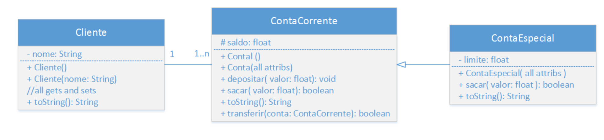

## Prova-POO


#### Aluno: Uanderson Henrique Batista da Silva  /   Matricula: 21110435
#### Aluno: Wille Felix Batista / Matricula : 19112765

### **Exercicio 1:**
#### 1. Desenvolva uma solução para os seguintes requisitos abaixo:
 ##### a. Relação entre entidades
  ###### i. Uma Compra tem um conjunto de Produtos
  ###### ii. Um Produto tem diversos Itens
 ##### b. Requisitos funcionais
  ###### i. Adicionar produto ao carrinho
  ###### ii. Obter o valor total da compra
  ###### iii. Listar produtos no carrinho
#### Main:
```java
```
#### :
```java

```
### **Exercício 2:** 
#### 2. Desenvolva uma solução para os seguintes requisitos abaixo:
##### a. Relação entre entidades
###### i. Um Estacionamento tem diversos Carros
###### ii. Cada Carro tem diversas pessoas dentro dele (podendo ou não ter sua capacidade máxima ocupada)
##### b. Requisitos funcionais
###### i. Adicionar um Carro a um Estacionamento
###### ii. Obter a quantidade total de pessoas no Estacionamento
###### iii. Obter a quantidade total de pessoas dentro do estacionamento
###### iv. Listar Carros no estacionamento

#### Main:

```java
package prova.questao2;

public class Main {
    public static void main(String[] args) {
        estacio est = new estacio();
        est.setCarros_Pessoas("SUV", 5);

        est.setCarros_Pessoas("GOL", 3);

        est.setCarros_Pessoas("CELTA", 4);

        est.setCarros_Pessoas("FERRARI", 2);

        est.setCarros_Pessoas("MUSTANG", 2);
        
        est.getTotal_Pessoas();

        est.getEstacionamento();
    }  
}

```

#### Parking:
```java
package prova.questao2;

import java.util.HashMap;
import java.util.Map;

public class Parking {
    private String Estacionamento;
    private String Carros;
    private Integer Pessoas;
    private String key;

    Integer Total_Pessoas = 0;
    Integer Total_Carros = 0;
    

    Map<String, Integer> estacionamento = new HashMap<>();

    public String setCarros_Pessoas(String Carros2, Integer Pessoas2) {
        this.Carros = Carros2;
        this.Pessoas = Pessoas2;
        this.Total_Pessoas += Pessoas2;
        this.Total_Carros +=1;
        setEstacionamento();
        return this.Carros;
	}

    public Integer getTotal_Pessoas(){
        System.out.println("Tem um total de " + Total_Pessoas + " pessoas no estacionamento e um total de " + Total_Carros + " carros no estacionamento.");
        return Total_Pessoas;
    }

    
    public String setEstacionamento(){
        estacionamento.put(Carros, Pessoas);
        return Estacionamento;
    }


    public String getEstacionamento(){
        for(String key : estacionamento.keySet()){
            System.out.println(key + ": " + estacionamento.get(key)+ " pessoas.");
        }
		return Estacionamento;
    }

}

```

### **Exercício 3:** 

Suponha que você irá desenvolver um novo aplicativo. O aplicativo
deve permitir que usuários realizem login com base em um formulário,
ou com base em plataformas de Single Sign-On, tais como login com
Google, Facebook ou iCloud. Desenvolva sua solução com a
flexibilidade de optar por um dos métodos de login. Além disso, deve
ser possível adicionar novos métodos de login no futuro.

#### main:

```java

```
#### Employee:
```java

```


### **Exercício 4:** 
Suponha que você irá desenvolver um módulo de pagamento para um
aplicativo. O módulo deve ter suporte aos seguintes tipos de
pagamento: PIX, Cartão de Crédito ou Boleto. Desenvolva sua solução
com a flexibilidade de optar por um dos métodos de pagamento. Além
disso, deve ser possível adicionar novos métodos de pagamento no
futuro.

#### main:

```java

```
#### :

```java

```

### **Exercício 5:** 

Suponha que você irá desenvolver um módulo para comunicação
UFALBluetooth. No padrão UFALBluetooth, pode-se ter duas formas de
comunicação, a saber: serial ou baseado em pacotes. A forma de
abertura e fechamento de conexão são semelhantes entre ambas.
Entretanto, a forma de processamento dos dados é diferente.
Desenvolva uma solução que executa os seguintes passos: (1)
estabelece uma conexão UFALBluetooth; (2) processa os dados; e (3)
fecha a conexão. Sua solução deve ser capaz de utilizar qualquer uma
das formas supracitadas.


#### main:

```java

```
#### Client:

```java

```


### **Exercício 6:**

Crie classes de forma a representar o diagrama a seguir:

<div>
    
</div>

#### a. A classe ContaEspecial herda da classe ContaCorrente.
#### b. Clientes que possuem conta especial possuem um limite de crédito. Dessa forma, podem fazer saques até esse valor limite, mesmo que não possuam saldo suficiente  na conta.
#### c. O construtor da classe ContaEspecial deve receber como parâmetro, além dos parâmetros da superclasse, o limite que o banco disponibiliza para o cliente.
#### d. Sobrescreva o método sacar na classe ContaEspecial, de modo que o cliente possa ficar com saldo negativo até o valor de seu limite. Note que o atributo saldo # da classe ContaCorrente deve ser do tipo protected para que possa ser modificado na subclasse.

#### main:

```java

```


